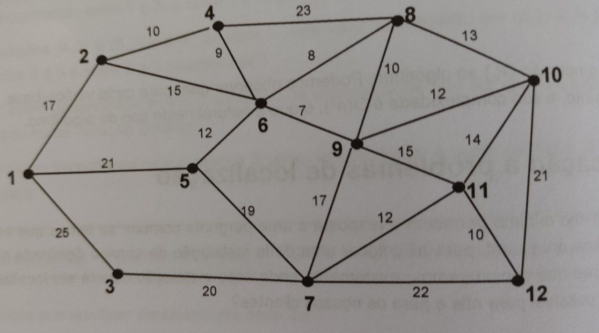
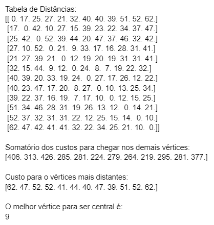
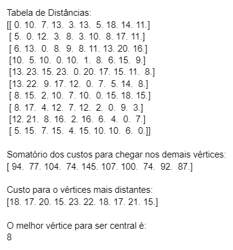
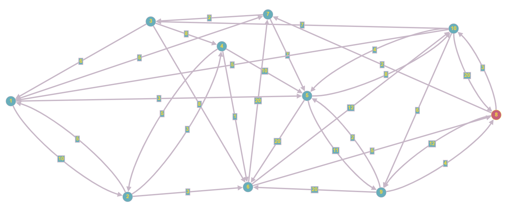

# GRAFO-Atividade-2

# Problema:-------------------------------------------------

```
  import numpy as np
```

Considere o problema em que existe uma instalação de múltiplos sensores em uma área rural. Apesar esses sensores trabalharem em uma rede mesh distribuída, os comandos precisam chegar a uma estação central, onde roda um sistema supervisório que monitora as condições climáticas, a saúde da plantação, entre outras coisas.

# Cenário 1:
Nesta aplicação, vamos supor 12 locais de instalação de sensor, mas um deles deve ser escolhido como estação central. Usando os conceitos de teoria dos grafos, cada local de instalação pode ser considerado um vértice, enquanto o custo de comunicação (ou distância) entre eles são as arestas. O grafo a seguir representa isso:



Para encontrar o melhor vértice para ser o central, podemos aplicar uma otimização considerando dois parâmetros. Tomando um vértice candidato a vértice central, computamos o somatório dos custos para chegar nos demais vértices e o custo para o vértice mais distante, para questões de desempate.

## Leitura do arquivo

Nesse caso, temos um grafo não orientado. Esse grafo pode ser representado pelo arquivo grafo01.txt que segue o formato:
```
<num_vertices> <num_arestas>
<vertice_inicial> <vertice_final> <custo> <- Repetição para cada aresta
```

Foi usado o TAB (\t) como separador. Faça a leitura do arquivo:
                                
## Computação de caminho mínimo
                                               
Implemente um algoritmo de computação de caminho mínimo que considere cada vértice do grafo como potencial vértice inicial, isso deve gerar uma tabela relacionando cada vértice (linhas) e a distância para os demais (colunas).

```
def gerar_tabela_dist(G):
  D = np.zeros((1,1)) # Alterar Criando um matriz de 1x1 com zeros
  ### Faça o código aqui
  return D

D = gerar_tabela_dist(G)
print(D)                    
```
                
## Cálculo dos vetores de distância
                                               
Calcule os vetores de somatório de distâncias e o vetor de distâncias máximas para cada linha da tabela/matriz D.
                                               
```
def dist_sum_vec(D):
  dist_vec = np.zeros(D.shape[0]) #criando um array com tamanho linhas da matriz 
  ### Faça o código aqui
  return dist_vec

def max_dist_vec(D):
  max_vec = np.zeros(D.shape[0])#criando um array com tamanho linhas da matriz
  ### Faça o código aqui
  return max_vec

dist_vec = dist_sum_vec(D)
max_vec = max_dist_vec(D)

print(dist_vec)
print(max_vec)
```
                                               
## Determinando a estação central
                                               
Use os dados e informações computadas para determinar o vértice que será usado como estação central.
                                               
# Cenário 2:
                                               
Agora que o cenário 1 foi resolvido, vamos testar em outras situações (pode fazer chamadas das funções já implementadas). Encontre o vértice que representa melhor uma estação central no grafo apresentado no arquivo grafo02.txt. Dessa vez, considere um grafo direcionado, portanto a função que calcula a matriz de caminho mínimo gerar_tabela_dist(G) vai mudar.

# Solução: ----------------------------------------------------------------

  A resolução é feita em 2 arquivos, o ***sensor.py*** que responsável pela parte da resolução do problema, o ***grafo.py*** que serve para criar No e Aresta(funções para gerenciamento de um grafo).
 
  Na ***primeira parte*** do problema e gerado o grafo através da entradas dos arquivos ***grafo01.txt*** e ***grafo02.txt***, onde na função
  
 > criar_grafo(G,arq)
 
  Em ***sensor.py*** e  recebe um objeto do tipo grafo é um arquivo contendo como entrada a quantidade de nós, a quantidade de arestas é as aresta do tipo ***u v peso***
  
  Na ***segunda parte*** do problema teremos que busca o caminho mínimo, por meio da implementação do algoritmo de  ***Floyd***, que está dentro do arquivo ***grafo.py***
  
> Floyd(self)

  Onde para cada vértice ele calculara o caminho mínimo com outros vértices, formando uma tabela do tipo:
  
  ```
                  Vértice 1          Vértice 2            ...         Vértice n
  
  Vértice 1     	     0                x                                n
  
  Vértice 2            x                0                                y
  
     ...
     
  Vértice n            n                y                                0
  ```
              	
  
  sendo x,y,n os custos do mínimo entre o vertice (vertice k, vértice j) assim em diante
  
  Na ***terceira parte*** do problema ele irá somar os custo mínimo de um vértice aos outros vértices, exemplo o somatório dos custos do vértice 1, seria o custo do vértice 1 até vértice 2 mais o custo do vértice 1 até vérticee 3 e assim por diante, e guarda o maior custo ao vértice mais distante, através das funções
  
> dist_sum_vec(D)

> max_dist_vec(D)

 Na ***quarta parte*** com o somatório dos custo mínimo de cada vértice ao outros vértices, e com o maior custo ao vértice mais distânte, ele irá decidir qual vértice será o central através da função 
 
 > Central(dist_vec,max_vec)
 
 Na qual ele escolherá o vértice que possuir o menor  somatório dos custos, em caso de dois vértices distintos com somatório iguais ele irá escolher aquele que possuir a menor distância ao vértice mais distante.


## Entrada: 
  Arquivo txt,
  
  Primeira linha será quantidade de vértices é numero de aresta, 
  
  Próximas linhas será às aresta do tipo ***vértice u*** o ***vértice v*** é ***peso***
  
## Saída:
  Tabela de distância,
  
  Lista de somatório de custos,
  
  Lista de custo do vértice mais distante ,
  
  Vértice central,
  
## Exemplo de execução:
### Caso 1: 

### Caso 2:


### Grafo montado atravez do site : http://graphonline.ru/pt/?graph=egPfoQXzkBxyZagD
